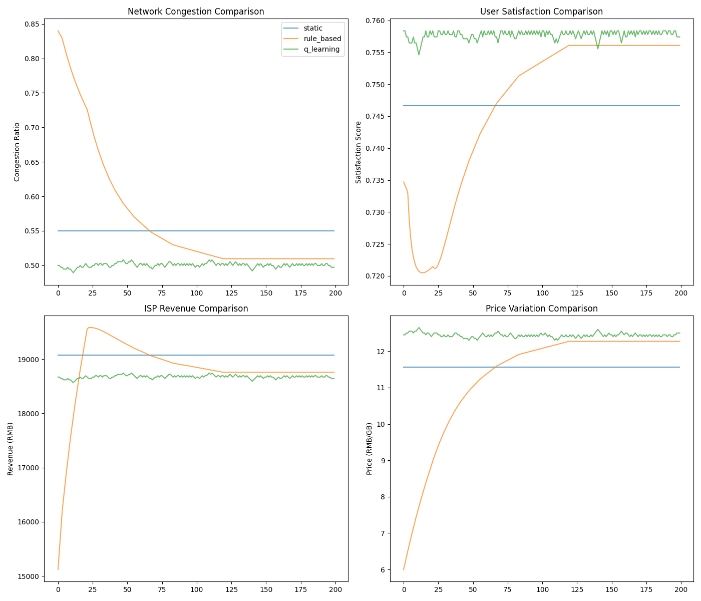

# Pricing-Algorithm-for-ISP

## Project Background
This is the code repository for the final project of The Chinese University of Hong Kong, Shenzhen's Spring 2025 course EIE3280. 

In response to the prevalent network congestion issues during peak hours (e.g., 10 PM to 1 AM) in campus networks, our team has proposed several simple Internet Service Provider (ISP) pricing algorithm strategies aimed at reducing network congestion ratio during specific time periods. These strategies include both dynamic pricing algorithms and static pricing algorithms. 

The specific implementation details of the three methods are included in our final report (the report will be uploaded to this repository around May 11th).

## Team Members
1. LIANG Xinyu(梁馨予)   ID:121010060 (Project Leader)
2. CAO Xiaohui(曹小慧)   ID:122040049
3. YANG Jiahao(杨家豪)   ID:122090646
4. JIANG Tianyi(蒋天依)  ID:121090232

## Scenario Settings
To simplify the project simulation process, we assume the following conditions:
1. Users are categorized into light, moderate, and heavy usage groups based on network consumption patterns. For example:
   - Light users: Basic communication needs (e.g., WeChat)
   - Moderate users: Video streaming needs (e.g., BiliBili)
   - Heavy users: Gaming needs (e.g., FPS games)

2. Each user category possesses the following attributes (using heavy users as an example):
   - **Maximum data requirement**: The data volume required for optimal experience (e.g., gaming at highest graphics settings)
   - ​**Minimum data requirement**: The essential data volume for basic functionality (e.g., smooth gameplay in competitive matches)
   - ​**Price sensitivity**: Degree of responsiveness to pricing changes (heavy users exhibit lower sensitivity due to higher real-time demands)
   - ​**Price threshold**: Maximum willingness-to-pay for optimal data allocation (heavy users exhibit higher threshold due to higher real-time demands)

4. Users' data consumption will only vary with current network pricing. While additional influencing factors could be incorporated for refined modeling, our code implementation focuses on this core mechanism.

## Code Structure
The project directory is organized as follows:

```bash
Pricing-Models-Simulator
├─config
│ ├─q_learning.yaml                  # Q-learning hyperparameters
│ ├─rule_based.yaml                  # Rule-based pricing parameters
│ ├─static_pricing.yaml              # Static pricing parameters
│ └─user_types.yaml                  # User type parameters
├─data
│ └─trained_model
│   └─q_table.pkl                    # Q-learning model trainning results
├─src
│ ├─_1_user_behavior.py              # User behavior functions (data usage & satisfaction calculations)
│ ├─_2_Q_learning.py                 # Q-learning pricing model
│ ├─_2_static_pricing.py             # Static pricing model
│ ├─_3_rule_based.py                 # Rule-based pricing model
│ ├─_3_network_simulator.py          # Simulator for Q-learning training & model comparison
│ ├─_4_dashboard.py                  # Frontend implementation
│ └─_4_result.py                     # Result analysis
└─Original Code                      # (Archived pre-integration implementations - for documentation purposes only)
```

​**Note:​**​ The `Original Code` folder contains pre-integration implementations preserved for historical reference, but is not part of the current operational codebase.

## Simulator Execution
Navigate to the `src` directory and run `_3_network_simulator.py`:
```bash
cd src
python _3_network_simulator.py
```

## Execution Results
After running the project, generated visualizations will be saved in the `src` folder:
```bash
└─src
   ├─q_learning_performance.png
   ├─rule_based_performance.png
   ├─static_performance.png
   ├─strategy_comparison.png
   └─ ....... # other code files
```
Key visualizations:
- `strategy_comparison.png`: Comparative analysis of model performance metrics
- `*_performance.png` files: Training process recordings for each algorithm
  
**Sample Training Visualization**​  
  

### Brief explanation
Through this simulation, we aimed to regulate network congestion rates towards the target level (0.5). Our observations include:

1. ​**Congestion Target Achievement**​ (Primary Metric)  
   - Q-learning pricing: Fluctuates around 0.5 congestion rate
   - Rule-based pricing: Approaches but fails to consistently reach 0.5
   - Static pricing: Remains fixed with no fluctuation (predefined pricing)

2. ​**Average User Satisfaction**​ (Secondary Metric)  
   - Q-learning achieves the highest satisfaction post-convergence
   - Rule-based shows moderate satisfaction levels
   - Static pricing yields the lowest satisfaction

3. ​**ISP Revenue Considerations**​  
   - Current evaluation lacks penalty mechanisms for exceeding congestion thresholds
   - Requires further refinement in revenue modeling

4. ​**Pricing Dynamics**​  
   Reveals the underlying relationship between:  
   - Price adjustments ➔ Congestion rate changes  
   - Price thresholds ➔ User satisfaction shifts  
   Highlights the critical need for balanced pricing strategies

## Frontend Execution
To modify simulation parameters: You need adjust yaml files in the config directory files. Alternatively, use our ​visual frontend​ for simplified parameter tuning (see below)

Navigate to the `src` directory and launch the dashboard:
```bash
cd src
streamlit run _4_dashboard.py
```

## Code Contributions
The project adopts a modular development approach with clear division of responsibilities:

| Code Prefix | Contributor       | Key Responsibilities |
|-------------|-------------------|----------------------|
| `_1_*`      | JIANG Tianyi      | Defined heavy/moderate/light user classes |
| `_2_*`      | YANG Jiahao       | Implemented Q-learning & static pricing strategies<br>Integrated user behavior module & network simulator module <br>Developed satisfaction & Data usage functions |
| `_3_*`      | LIANG Xinyu       | Built network simulator<br>Implemented rule-based pricing strategy |
| `_4_*`      | CAO Xiaohui       | Developed visualization dashboard<br>Finalized system integration |

​**We sincerely appreciate all team members' dedicated contributions!​**​ ❤️
